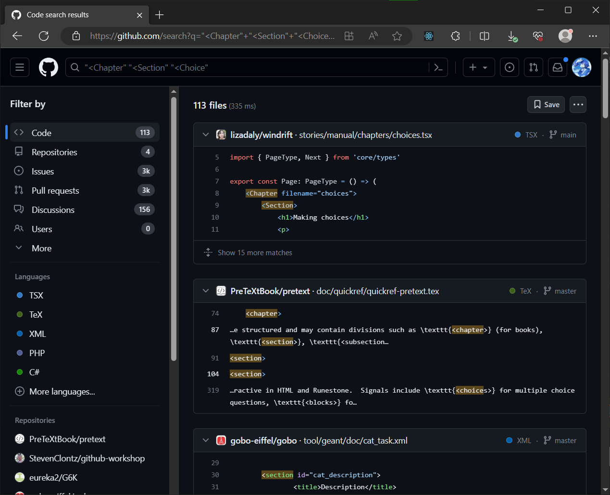

# Interactive storytelling

By **interactive storytelling**, I mean text-based interactive fiction (e.g. Lost Pig), visual novels (e.g. Danganronpa), interactive films (e.g. Death Come True), and whatever category _A Dark Room_ falls under.

## Engines

Engines, frameworks, libraries, etc.

- Windrift
    * https://github.com/lizadaly/windrift
    * https://windrift.app/

    * [ ] PLAY https://lizadaly.com/pages/harmonia/

    * [x] Interactive marginalia. Some asides about asides | by Liza Daly | Medium
    https://medium.com/@liza/interactive-marginalia-f39424877d73

    * Forgot the name of the project, but still remembered a bit about its API.
      Searching for `"<Chapter" "<Section" "<Choice"` returned:
      

- Strand https://github.com/seleb/strand
    * ROUND TABLE uses their own IF library, Strand.

- Ink https://github.com/inkle/ink
    * "inkle's open source scripting language for writing interactive narrative."
    * Inky https://github.com/inkle/inky
        +  "An editor for ink: inkle's narrative scripting language"
        + [ ] Try it
    * [~] READ https://github.com/inkle/ink/blob/master/Documentation/WritingWithInk.md

    * [x] Creating Interactive Film Scripts for 3D Adventures with Ink | GDC 2017 | YouTube
    https://www.youtube.com/watch?v=3eYHtDGOM8U

    * [x] Narrative Sorcery: Coherent Storytelling in an Open World | GDC 2017 | YouTube
    https://www.youtube.com/watch?v=HZft_U4Fc-U   

- [Monogatari](https://github.com/Monogatari/Monogatari)
    * https://monogatari.io
    * "Monogatari is a simple web visual novel engine, created to bring Visual Novels to the web."

- Inform
    * https://github.com/ganelson/inform
    * "The core software distribution for the Inform 7 programming language."

- [Undum](https://idmillington.github.io/undum/)
    * https://github.com/idmillington/undum
    * A client-side framework for hypertext interactive fiction games.

- https://github.com/lazerwalker/storyboard
To make an #interactivefiction or even a #visualnovel.

    * From README:
    > Storyboard is a general-purpose engine for multilinear/nonlinear storytelling. \
    > It's written in TypeScript, and intended to be embedded within another game or application.

    * KAITO: Its syntax is similar to Ink.

- https://nickm.com/curveship/
> Curveship is a system for automatic narrative variation: It can relate the same underlying events in different ways, expressing the same content via different narrative discourses. Curveship can tell events out of order, as with flashback. It can designate different characters as the narrator or narratee (the one telling or the one to whom the narrative is told), and, for instance, can tell the story from a standpoint before, during, or after the events themselves.

- Yarn Spinner https://github.com/YarnSpinnerTool/YarnSpinner
    * "Yarn Spinner is a tool for building interactive dialogue in games!"
    * In C#

## Games

- [ ] We Follow The Fickle Path by SweetHeart Squad
    * https://sweetheartsquad.itch.io/we-follow-the-fickle-path
    * https://github.com/SweetheartSquad/GameOff2021
    * KAITO: By the same ones who made ROUND TABLE, which I liked.
    * Says its genre is 'visual novel'.
    * It was created for Game Off 2021 (theme: BUGS).

- [ ] The Stanley Parable
    * Recommended by Lina.

- [x] A Dark Room
    * https://en.wikipedia.org/wiki/A_Dark_Room
    * https://github.com/doublespeakgames/adarkroom
    * http://adarkroom.doublespeakgames.com

---

FIN.
